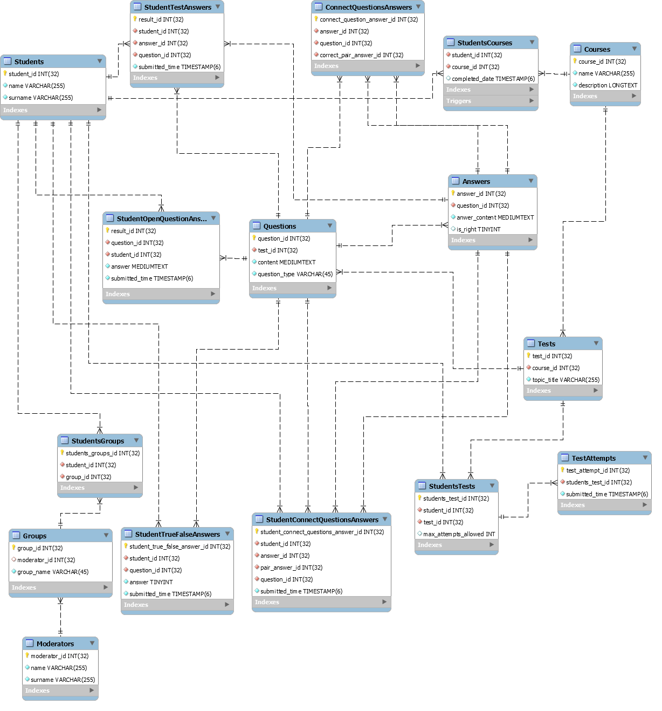

# Knowledge Testing System Database

### ER diagram looks as follows:




### Examples of SQL queries:
###### 1. Select all students enrolled to the course (id 7):
```sql
SELECT students.student_id, name, surname FROM students
JOIN studentscourses 
ON students.student_id = studentscourses.student_id
WHERE course_id = 7
``` 

student_id | name | surname
|---|---|---|
4 |	Martin |	Fowler
5 |	Mary |	Williams
6 |	Kate |	Devis
7 |	Ann |	Anderson
11 |	Alice |	Liddell
12 |	Dale |	Smith


###### 2. Select all courses to which particular student (id 8) is enrolled:
```sql
SELECT courses.course_id, name FROM courses 
JOIN studentscourses
ON courses.course_id = studentscourses.course_id
WHERE studentscourses.student_id = 8
```

course_id | name
|---|---|
5 |	DB basics
8 |	Advanced Java for web
6 |	Java advanced


###### 3. Select all tests for the course (id 7):
```sql
SELECT test_id, topic_title FROM tests
WHERE course_id = 7
```

test_id | topic_title
|---|---|
7 |	Spring MVC essentials
8 |	Web architecture
9 |	DropWizard


###### 4. Select all not completed tests for the student (id 8):
```sql
SELECT tests.test_id, topic_title FROM tests
INNER JOIN studentstests
ON tests.test_id = studentstests.test_id
WHERE student_id = 8
AND completed_date IS NULL
```

test_id | topic_title
|---|---|
1 |	What is db?
2 |	Query language
3 |	Relations
10 |	gRPC, HTTP/2
11 |	Apache Kafka
4 |	Connection to sockets
5 |	Connection to DB
6 |	JMX tools


###### 5. Select all questions for the test (id 2)
```sql
SELECT question_id, content, question_type FROM questions WHERE test_id = 2
```

question_id | content | question_type
|---|---|---|
2 |	What SQL stands for? |	OPEN
3 |	What CRUD stands for? |	OPEN
13 |	INSERT command belongs to |	TEST
14 |	Connect commands of one type |	CONNECT


###### 6. Select all answers for the test question (id 13)
```sql
SELECT answer_id, answer_content, is_right FROM answers WHERE question_id = 13
```
answer_id | answer_content | is_right
|---|---|---|
78 |	DDL |	0
79 |	DML |	1
80 |	DCL |	0
81 |	DQL |	0


###### 7. Select all answers for the connection type question (id 14)
**Left side answers**
```sql
SELECT answer_id, answer_content FROM answers WHERE answer_id IN
(SELECT answer_id FROM connectquestionsanswers WHERE question_id = 14)
```

answer_id | answer_content
|---|---|
82 |	INSERT
84 |	COMMIT
86 |	CREATE

**Right side answers**
```sql
SELECT answer_id, answer_content FROM answers WHERE answer_id IN
(SELECT correct_pair_answer_id FROM connectquestionsanswers WHERE question_id = 14)
```

answer_id | answer_content
|---|---|
83 |	UPDATE
85 |	ROLL BACK
87 |	ALTER


###### 8. Check student answer for open type question (id 2):
```sql
SELECT studentopenquestionanswers.question_id, answer AS student_answer, answer_content AS correct_answer FROM studentopenquestionanswers 
JOIN answers ON studentopenquestionanswers.question_id = answers.question_id
WHERE studentopenquestionanswers.question_id = 2
```

question_id | student_answer | correct_answer
|---|---|---|
2 |	Structured Query Language |	Structured Query Language


###### 9. Check student answer for test type question (id 13):
```sql
SELECT studenttestanswers.question_id, studenttestanswers.answer_id AS student_answer, answers.answer_id AS correct_answer FROM studenttestanswers 
RIGHT JOIN answers ON studenttestanswers.question_id = answers.question_id
WHERE studenttestanswers.question_id = 13 AND answers.is_right = true 
```
question_id | student_answer | correct_answer
|---|---|---|
13 |	80 |	79


###### 10. Check student answer for connect type question (id 14):
```sql
SELECT connectquestionsanswers.answer_id, studentconnectquestionsanswers.pair_answer_id AS student_pair_choice,
connectquestionsanswers.correct_pair_answer_id AS correct_pair FROM connectquestionsanswers
JOIN studentconnectquestionsanswers ON studentconnectquestionsanswers.answer_id = connectquestionsanswers.answer_id
WHERE connectquestionsanswers.question_id = 14
```

answer_id | student_pair_choice |correct_pair_answer_id
|---|---|---|
82 |	83 |	83
84 |	87 |	85
86 |	85 |	87


### Triggers
**DB contains two triggers to synchronize tables StudentsCourses and StudentsTests**

#### After insert
```sql
DELIMITER ;;
 CREATE TRIGGER `StudentsCourses_AFTER_INSERT` AFTER INSERT ON `studentscourses` FOR EACH ROW BEGIN
	INSERT INTO StudentsTests(student_id, test_id, completed_date) (SELECT NEW.student_id, test_id, NULL FROM Tests WHERE course_id = NEW.course_id);
END ;;
DELIMITER ;
```

#### After delete
```sql
DELIMITER ;;
CREATE TRIGGER `StudentsCourses_AFTER_DELETE` AFTER DELETE ON `studentscourses` FOR EACH ROW BEGIN
	DELETE FROM StudentsTests WHERE test_id IN (SELECT test_id FROM Tests AS t WHERE t.course_id = OLD.course_id);
END ;;
DELIMITER ;
```

#### List triggers
```sql
SHOW TRIGGERS
```
Trigger | Event | Table | Statement | Timing | Created | sql_mode | Definer | character_set_client | collation_connection | Database Collation
|---|---|---|---|---|---|---|---|---|---|---|
'StudentsCourses_AFTER_INSERT | INSERT | studentscourses | BEGIN <br/>	INSERT INTO StudentsTests(student_id, test_id, completed_date) (SELECT NEW.student_id, test_id, NULL FROM Tests WHERE course_id = NEW.course_id);<br/>END | AFTER | 2019-12-19 11:40:01.80 | STRICT_TRANS_TABLES,NO_ENGINE_SUBSTITUTION | root@localhost | utf8mb4 | utf8mb4_0900_ai_ci | utf8mb4_0900_ai_ci'
'StudentsCourses_AFTER_DELETE | DELETE | studentscourses | BEGIN <br/>	DELETE FROM StudentsTests WHERE test_id IN (SELECT test_id FROM Tests AS t WHERE t.course_id = OLD.course_id);<br/>END | AFTER | 2019-12-19 11:40:01.82 | STRICT_TRANS_TABLES,NO_ENGINE_SUBSTITUTION | root@localhost | utf8mb4 | utf8mb4_0900_ai_ci | utf8mb4_0900_ai_ci'


